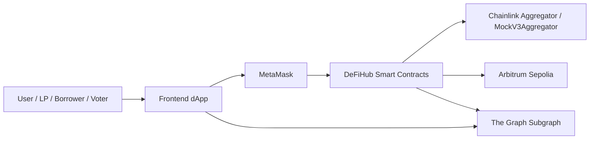
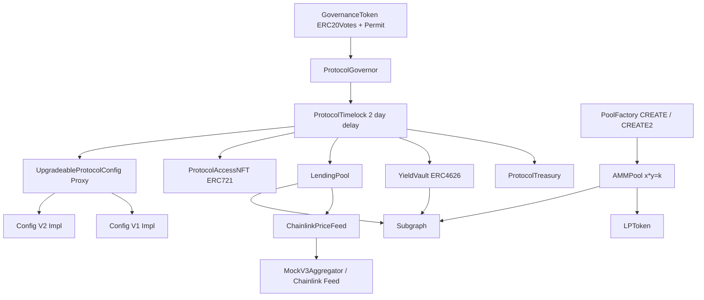
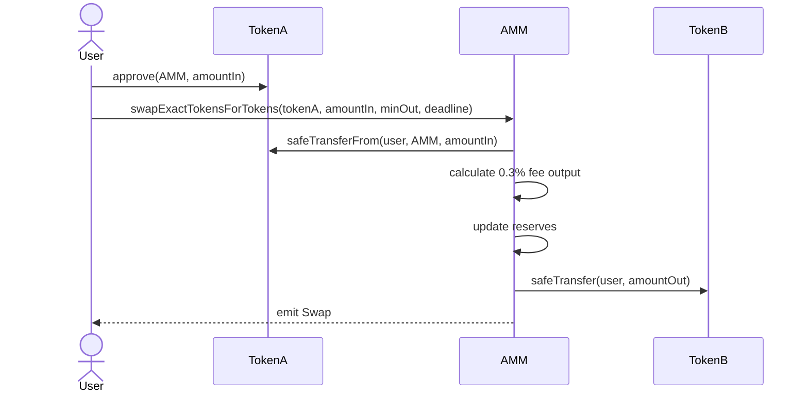
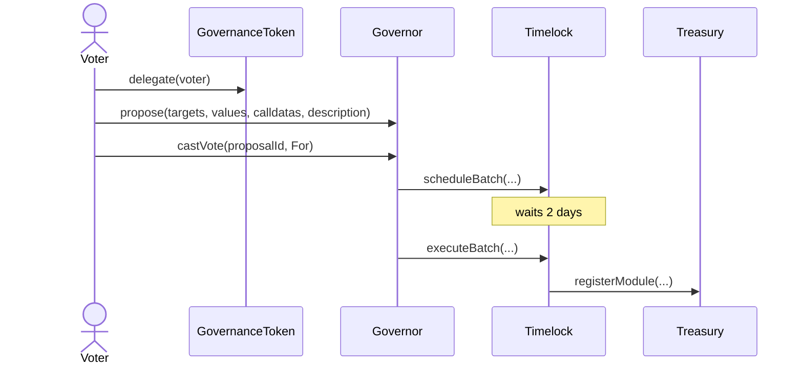
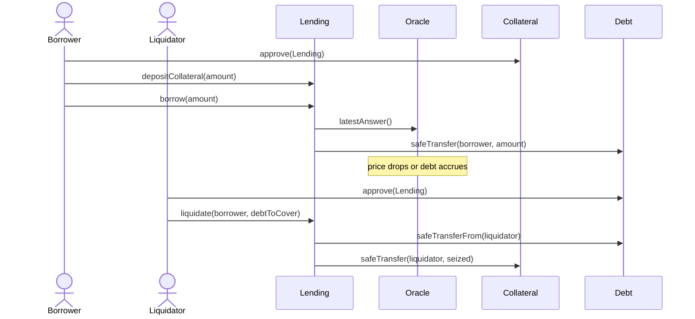

# Architecture Document

## 1. System Overview

DeFiHub is an Option A DeFi Super-App composed of a constant-product AMM, a collateralized lending pool, an ERC-4626 vault, Chainlink-style oracle adapter, ERC20Votes governance, Timelock-controlled treasury, The Graph indexing layer, and a browser frontend.

The protocol is deployed to Arbitrum Sepolia. The DAO controls privileged protocol ownership through `ProtocolTimelock`, which is connected to `ProtocolGovernor`.

## 2. C4 Level 1 Context

## 3. Container / Component Diagram

## 4. Critical Flows

### Swap

### Governance Propose Vote Queue Execute

### Deposit Borrow Liquidate

## 5. Storage Layout

### `UpgradeableProtocolConfig` V1

| Slot Order | Variable | Type |
|---|---|---|
| inherited | Initializable / OwnableUpgradeable / UUPSUpgradeable state | OpenZeppelin reserved layout |
| 1 | `feeBps` | `uint256` |
| 2 | `protocolName` | `string` |

### `UpgradeableProtocolConfigV2`

| Slot Order | Variable | Type |
|---|---|---|
| inherited | V1 layout | unchanged |
| 3 | `maxLtvBps` | `uint256` |

V2 only appends `maxLtvBps`; no V1 variables are reordered or removed. This prevents storage collision during UUPS upgrade.

### Core Contracts

| Contract | Key Storage |
|---|---|
| `AMMPool` | immutable `tokenA`, `tokenB`, `creator`, `lpToken`; mutable `reserveA`, `reserveB` |
| `LendingPool` | immutable assets/feed; mutable risk params; `accounts[user]` collateral, principal, last accrual |
| `YieldVault` | OpenZeppelin ERC4626/ERC20 storage |
| `ProtocolTreasury` | immutable `owner`; `moduleAddress[Module]` |
| `ProtocolGovernor` | OpenZeppelin Governor proposal/vote storage |
| `ProtocolTimelock` | OpenZeppelin Timelock operation timestamps and roles |
| `GovernanceToken` | ERC20Votes balances, checkpoints, permit nonces |

## 6. Trust Assumptions

- The Timelock is the long-term owner of privileged contracts.
- The deployer is only a bootstrap account and must not keep Timelock admin rights.
- Governor proposals are delayed by 2 days before execution.
- Chainlink feeds are trusted for price availability and correctness within the configured staleness window.
- If the deployer key is compromised before bootstrap completion, ownership transfer and role setup can be attacked.
- If governance voting power is concentrated, whale governance remains possible; quorum and proposal threshold reduce but do not eliminate this risk.

## 7. Design Patterns

| Pattern | Usage | Reason |
|---|---|---|
| Factory | `PoolFactory` creates AMM pools via CREATE and CREATE2 | Deterministic pool deployment and repeatable deployment paths |
| Proxy / UUPS | `UpgradeableProtocolConfig` V1 -> V2 | Demonstrates controlled upgrade path with storage compatibility |
| Checks-Effects-Interactions | AMM/lending withdrawals update accounting before or with guarded external calls | Reduces reentrancy risk |
| Access Control / Ownership | Ownable and Timelock ownership on privileged operations | Prevents unguarded admin changes |
| Oracle adapter | `ChainlinkPriceFeed` wraps aggregator | Centralizes stale/invalid price validation |
| Timelock | `ProtocolTimelock` | Delays governance execution |
| Reentrancy Guard | AMM and lending state-changing external functions | Blocks reentrant token/ETH callback patterns |

## 8. ADR Log

### ADR-001: Use Foundry

Context: The project requires fuzz, invariant, fork, and gas tests.  
Decision: Use Foundry.  
Consequence: Fast Solidity-native test suite and reproducible scripts.

### ADR-002: Use AMM and Lending

Context: Option A requires AMM + lending + vault.  
Decision: Implement both AMM and lending from scratch.  
Consequence: Larger test surface but stronger coverage of course requirements.

### ADR-003: Timelock Owns Privileged Contracts

Context: Admin powers must be governed.  
Decision: Transfer ownership of governance token, vault, lending pool, badge, and config proxy to Timelock.  
Consequence: Parameter changes require governance lifecycle.

### ADR-004: Chainlink Adapter Layer

Context: Raw aggregators do not enforce local staleness policy.  
Decision: Wrap feeds in `ChainlinkPriceFeed`.  
Consequence: Lending consumes validated prices only.

### ADR-005: Static Frontend

Context: A minimal dApp is sufficient for course frontend requirements.  
Decision: Use HTML/CSS/JS with ethers CDN.  
Consequence: Easy to run locally, but less scalable than a full React build.
